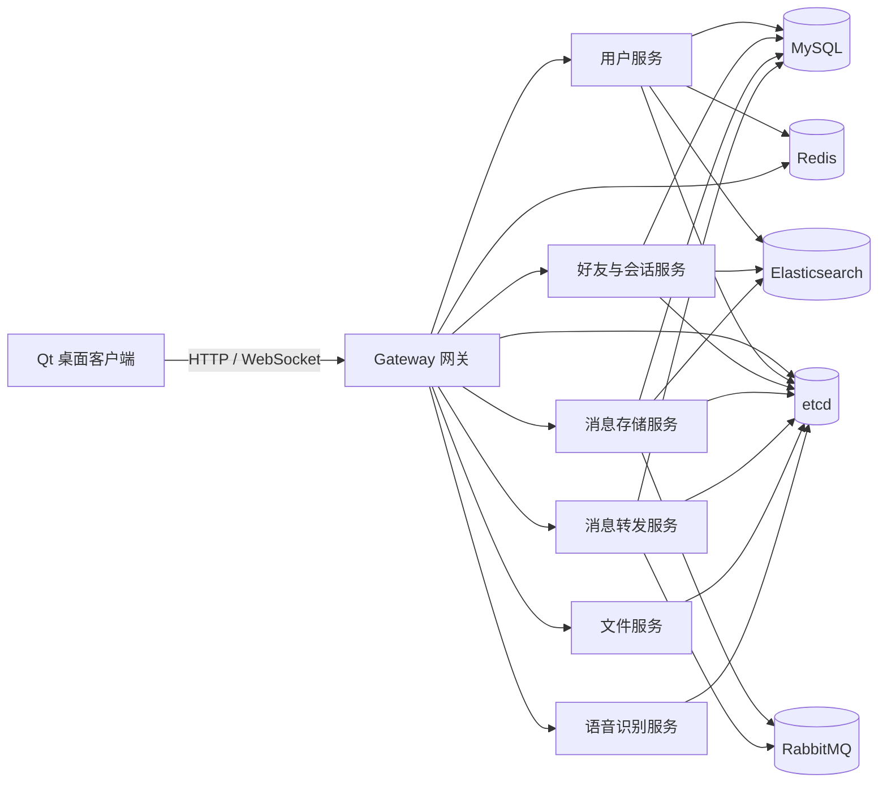

# ChatSystem

一个使用 C++ 实现的分布式即时通信系统。项目包含 Qt 桌面客户端、WebSocket/HTTP 网关以及按业务拆分的后端微服务，可用于学习即时通信、服务发现、RPC、消息队列和数据持久化等技术。


## 功能特性

- 用户名注册与登录
- 手机号注册、登录和短信验证码
- 用户资料、头像、昵称、签名和手机号管理
- 好友搜索、好友申请、申请处理和好友删除
- 单聊与多人会话
- 文本、图片、文件和语音消息
- 历史消息、最近消息和消息搜索
- WebSocket 实时消息通知
- 文件存储与语音识别
- 基于 etcd 的服务注册与发现

## 系统架构



## 服务说明

| 服务 | 默认端口 | 职责 |
| --- | ---: | --- |
| Gateway | 9000 / 9001 | HTTP API、WebSocket 长连接和请求转发 |
| Speech | 10001 | 语音识别 |
| File | 10002 | 文件上传与下载 |
| User | 10003 | 注册、登录和用户资料 |
| Transmit | 10004 | 消息投递与转发 |
| Message | 10005 | 消息持久化、历史记录和搜索 |
| Friend | 10006 | 好友关系和聊天会话 |
| etcd | 2379 | 服务注册与发现 |
| MySQL | 3306 | 关系数据存储 |
| RabbitMQ | 5672 | 异步消息传递 |
| Redis | 6379 | 登录状态、会话和验证码缓存 |
| Elasticsearch | 9200 / 9300 | 用户与消息检索 |

## 技术栈

### 客户端

- C++17
- Qt 6 Widgets
- Qt Network、WebSockets、Protobuf、Multimedia
- CMake

### 服务端

- C++ / CMake
- brpc + Protobuf
- WebSocket++
- etcd-cpp-apiv3
- MySQL + ODB
- Redis / redis-plus-plus
- RabbitMQ
- Elasticsearch
- gflags、spdlog、fmt
- Docker Compose

## 目录结构

```text
ChatSystem/
├── client/
│   ├── ChatClient/          # Qt 桌面聊天客户端
│   └── ChatServerMock/      # 客户端联调使用的模拟服务端
└── server/
    ├── common/              # 日志、RPC、数据库、缓存等公共组件
    ├── conf/                # 各服务的 gflags 配置
    ├── file/                # 文件服务
    ├── friend/              # 好友与会话服务
    ├── gateway/             # HTTP / WebSocket 网关
    ├── message/             # 消息存储服务
    ├── odb/                 # ODB 数据模型
    ├── proto/               # Protobuf 接口定义
    ├── speech/              # 语音识别服务
    ├── sql/                 # MySQL 初始化脚本
    ├── transmite/           # 消息转发服务
    ├── user/                # 用户服务
    └── docker-compose.yml   # 基础设施及后端服务编排
```

## 环境要求

推荐在 Ubuntu 22.04 或兼容的 Linux 环境中构建服务端，并提前安装：

- GCC/G++、CMake、Make
- Protobuf 编译器与开发库
- brpc、gflags、spdlog、fmt
- OpenSSL、LevelDB、JsonCpp、Boost、libcurl
- ODB 及 MySQL 运行库
- etcd-cpp-apiv3、hiredis、redis-plus-plus
- RabbitMQ C/C++ 客户端库
- 阿里云 C++ SDK（短信服务）
- Docker 与 Docker Compose

客户端建议使用带有以下模块的 Qt 6：

- Widgets
- Network
- WebSockets
- Protobuf
- Multimedia

## 构建服务端

进入服务端目录后，分别构建各个微服务：

```bash
cd server

for service in file friend gateway message speech transmite user; do
  cmake -S "$service" -B "$service/build"
  cmake --build "$service/build" -j
done
```

收集容器运行所需的动态库和 `nc`：

```bash
bash depends.sh
```

## 配置

服务配置位于 `server/conf/`。运行前至少需要完成以下调整：

1. 将配置文件和 `docker-compose.yml` 中的 `10.0.0.235` 替换为实际可访问的主机地址。
2. 在部署环境中为用户服务提供阿里云短信密钥：

   ```text
   -dms_key_id=YOUR_ACCESS_KEY_ID
   -dms_key_secret=YOUR_ACCESS_KEY_SECRET
   ```

3. 在部署环境中为语音服务配置平台的 `app_id`、`api_key` 和 `secret_key`。
4. 根据实际环境修改 MySQL、RabbitMQ 等中间件的默认账号和密码。

> 不要把真实密钥、令牌或生产密码提交到 Git。推荐使用环境变量、Docker Secrets 或独立的私有配置文件注入敏感信息。

## 使用 Docker Compose 启动

完成服务端构建和配置后：

```bash
cd server
docker compose up -d --build
```

查看服务状态：

```bash
docker compose ps
```

查看日志：

```bash
docker compose logs -f
```

停止服务：

```bash
docker compose down
```

## 构建客户端

```bash
cmake -S client/ChatClient -B client/ChatClient/build
cmake --build client/ChatClient/build --config Release
```

客户端连接地址定义在 `client/ChatClient/network/NetClient.h`：

```cpp
const QString HTTP_URL = "http://127.0.0.1:8000";
const QString WEBSOCKET_URL = "ws://127.0.0.1:8001/ws";
```

当前 Docker Compose 暴露的 Gateway 端口为 `9000/9001`，启动客户端前需要将两处地址修改为实际网关地址和端口，或同步调整 Gateway 配置。

## 接口定义

服务端 Protobuf 接口位于 `server/proto/`，主要包括：

- `user.proto`：注册、登录和用户信息
- `friend.proto`：好友关系和聊天会话
- `message.proto`：消息存储、历史消息和搜索
- `transmite.proto`：消息转发
- `file.proto`：文件上传与下载
- `speech.proto`：语音识别
- `notify.proto`：实时通知
- `gateway.proto`：网关路由说明

## 安全说明

- 仓库中的默认中间件密码仅适用于本地开发，请勿直接用于公网环境。
- 曾经提交或公开过的云平台密钥应立即吊销并重新创建，仅从 Git 历史中删除并不能保证密钥安全。
- 生产环境应启用 HTTPS/WSS、访问鉴权、限流和审计日志。

## 参与开发

欢迎通过 Issue 提交问题或建议，也欢迎提交 Pull Request 完善功能、文档和测试。
